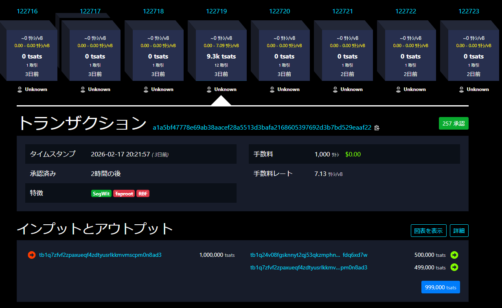

# transaction  
## 概要  
ビットコインにおけるトランザクションの書き方を説明しています。  
ここでは、Segwit方式、testnet4によるトランザクションを作成しました。  

作成したトランザクション：[a1a5bf47778e69ab38aacef28a5513d3bafa2168605397692d3b7bd529eaaf22](https://mempool.space/testnet4/tx/a1a5bf47778e69ab38aacef28a5513d3bafa2168605397692d3b7bd529eaaf22)  

## トランザクション作成の流れ  
アドレスのエンコードからトランザクションブロードキャストまでの流れを、作成したコードを元に説明します。  

作成したコード：[main.py](../main.py)  

### 1. アドレスを作成する  
```python
secret = SECRET
private_key = PrivateKey(secret)
public_key = private_key.point
compressed_pubkey = public_key.sec(compressed=True)
my_pubkey_hash = hash160(compressed_pubkey)
my_address = segwit_encode("tb", 0, my_pubkey_hash)
print(my_address)
```
* 秘密鍵（数値）から公開鍵を作成  
* 圧縮SECフォーマットでシリアライズ  
* hash160をかけて、算出された値（公開鍵ハッシュ）をBech32エンコード

### 2. インプットを指定する  
```python
prev_tx_hex = "02000000000101aca9611cb79e2f8504ea1e031e2ea52fe9982421a203655d4f22ca00e89f27810000000000ffffffff0240420f0000000000160014f092c4a841e9b99026a26ac9c80ff6b6d9b8603b18053d00000000001600145558f3a510b4e645a812a441616c379982aef52d02483045022100f0a9850a5c80d61a48689f9922bb41ebbf0cb62c54ef58bc82f834c6f5ad539102201dc751e8498548a23f210952e47ccbc95456d307555dca398a4cad3ed4e00a4f01210255949b16f0d6da522e715d208866fb7f35f5fde8dc5ce184bef3dff7b35c5baa00000000"
stream = BytesIO(bytes.fromhex(prev_tx_hex))
prev_tx = Tx.parse(stream)
prev_tx_id = bytes.fromhex(prev_tx.id())
prev_index = 0
tx_ins = []
tx_ins.append(TxIn(prev_tx=prev_tx_id, prev_index=prev_index, script_sig=None, sequence=0xffffffff, witness=None))
```
* mempool（[https://mempool.space/ja/testnet4](https://mempool.space/ja/testnet4)）から元の送金元のトランザクションの16進値を取得します。  
今回は、自分の別のアドレスから送金しました（[作成したトランザクション](../send_to_pubadd.py)）。  
* パースして、トランザクションIDとインデックスを取得します。  
* TxInオブジェクトとしてリストに格納します（今回はインプット１つ）。  

### 3. アウトプットを指定する  
```python
target_address = "tb1q24v08fgsknnyt2qj53qkzmphnxp2aafdq6xd7w"
target_amount = 500000
target_pubkey_hash = segwit_decode(target_address)[2]
target_script_pubkey = p2wpkh_script(target_pubkey_hash)

change_address = my_address
change_amount = 499000
change_script_pubkey = p2wpkh_script(my_pubkey_hash)

tx_outs = []
tx_outs.append(TxOut(amount=target_amount, script_pubkey=target_script_pubkey))
tx_outs.append(TxOut(amount=change_amount, script_pubkey=change_script_pubkey))
```
* 送金先用（相手宛て）とお釣り用（自分宛て）の2つのアウトプットを作成します。  
target_address : 送金相手（今回は半分だけ送り返します。）  
change_amount : 自分（499000 satoshi のお釣り→手数料は1000 satoshi になります。）  
* TxOutオブジェクトとして、リストに格納します。（アウトプット2つ）  

### 4. 署名してシリアライズする  
```python
tx_obj = 
Tx(version=2, tx_ins=tx_ins, tx_outs=tx_outs, locktime=0, testnet=True,segwit=True)
z = tx_obj.sig_hash_bip143(0, redeem_script=None, witness_script=None)
sig = private_key.sign(z).der() + SIGHASH_ALL.to_bytes(1, 'big')
tx_obj.tx_ins[0].witness = [sig, compressed_pubkey]

print(tx_obj.verify_input(0))
print(f'tx fee : {tx_obj.fee(testnet=True)}')

print(tx_obj.serialize().hex())
```
* tx_insリストとtx_outsリストを含めたTxオブジェクトを作成します。  
* BIP143形式でトランザクションハッシュを作成します。  
* ハッシュに対して秘密鍵で署名します（署名はDERエンコードし、SIGHASHフラグを追加）。  
* 自分の圧縮公開鍵と署名をwitnessに格納します。  
* インプットが有効か、手数料が想定している額かを確認した後、シリアライズしてブロードキャストします。  

### ブロードキャストされたトランザクション  
* 無事、mempoolでブロードキャストに成功しました。  

  

* 一定数以上の承認を得て、ブロックに取り込まれていることを確認できました。  
  